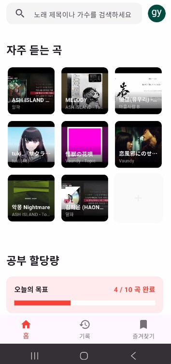
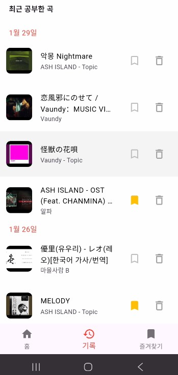
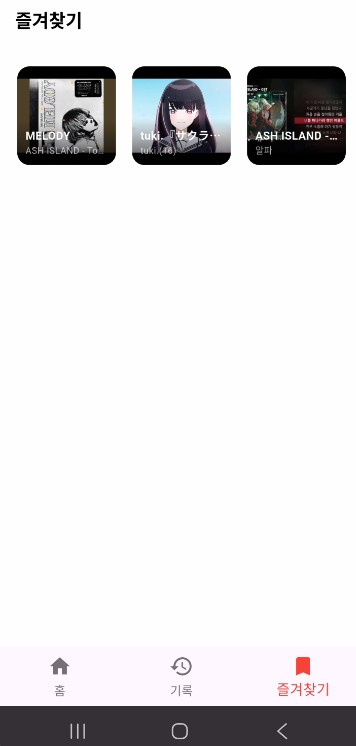
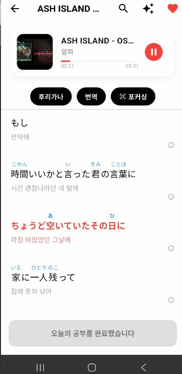
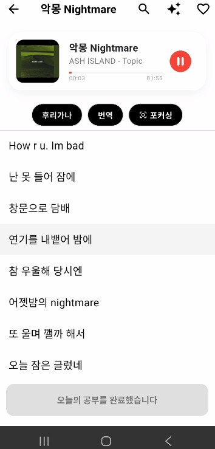
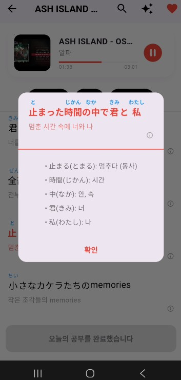

# 🎵 Kasi-AI (카시코이)
> **"가사(Kashi)를 AI가 알려주니까, 정말 똑똑하네(Kashikoi)!"**

좋아하는 J-POP 가사를 통째로 외워서 일본어를 마스터하고 싶어 만든 앱입니다. 유튜브로 노래를 들으면서, 궁금한 문법이나 단어를 AI(제미나이)에게 바로 물어보고 공부할 수 있습니다.

## 🔗 개발기 및 관련 포스팅
> **앱 개발 과정과 기술적인 고민들을 블로그에 기록하고 있습니다.**

* 📎 [개발기 #1: 앱을 왜 만들고 어떻게 시작했는가?](https://codingisland.tistory.com/116)
* 📎 [개발기 #2: AI와 협업하는 '바이브 코딩'의 시작](https://codingisland.tistory.com/117)
* 📎 [개발기 #3: 문제 해결과 아키텍처 고민 (현재)](https://codingisland.tistory.com/118) ```

> **⚠️ 상업적인 목적 없는 순수 공부용 프로젝트입니다.**

---

## 📸 미리보기 (Screenshots)

|  |  |  |
|:---:|:---:|:---:|
| **홈 화면 (노래 고르기)** | **공부 기록** | **즐겨찾기** |
|  |  |  |
| **AI 가사 풀이** | **정확한 가사 연결** |**단어 문법 공부** |
---

## ✨ 이런 기능이 있어요!

* **AI의 가사 과외**: Gemini AI가 가사 속 어려운 문법이나 일본 문화를 콕 집어 설명해줍니다.
* **로그인 안 해도 OK**: 로그인 없이도 내 폰(`Drift DB`)에 공부 기록이 저장됩니다.
* **똑똑한 동기화**: 로그인하면 내가 공부한 기록이 서버(`Firebase`)에 안전하게 저장되어 폰을 바꿔도 그대로입니다.
* **가사 찰떡 매칭**: 유튜브 제목에 붙은 [MV] 같은 잡음을 싹 제거하고, API 2개를 돌려 정확한 가사를 찾아줍니다.
* **노래 듣기**: 유튜브 영상을 가져오기에 노래 재생도 가능합니다.
---

## 🛠 사용한 기술 (Tech Stack)

| 분류 | 기술 | 비고 |
| :--- | :--- | :--- |
| **Framework** | **Flutter** | Dart 기반 크로스 플랫폼 |
| **AI Engine** | **Google Gemini** | 가사 번역 및 지능형 분석 핵심 |
| **Local DB** | **Drift** | 비로그인 유저 데이터 관리 (SQLite) |
| **Cloud DB** | **Firebase** | 로그인 유저 동기화 및 Firestore 활용 |
| **API** | **YouTube / LrcLib / Netease** | 가사 및 영상 정보 수집 |

---

## 💡 개발하며 해결한 고민들

### 1. "언제 데이터를 가져올까?" (성능 최적화)
처음엔 실시간으로 계속 데이터를 감시하게(`Stream`) 했더니 앱이 묘하게 느렸습니다. 그래서 꼭 필요할 때 한 번만 가져오는 방식(`Future`)으로 바꿨더니 훨씬 빠릿빠릿해졌습니다.


### 2. "로그인 유저 vs 비로그인 유저" (DB 관리)
로그인 여부에 따라 데이터를 저장하는 곳이 달라야 했습니다. 이걸 일일이 코드로 짜면 너무 복잡해서, **'데이터 관리자(Repository)'**를 하나 두고 로그인 상태에 따라 알아서 저장 위치(로컬 vs 클라우드)를 갈아끼우게 만들었습니다.


### 3. "AI 길들이기" (프롬프트)
AI가 가끔 헛소리를 하거나 형식을 무너뜨릴 때가 있었습니다. 그래서 더 똑똑한 AI한테 "얘한테 어떻게 명령해야 말을 잘 들을까?"라고 물어봐서 최적의 명령어를 찾아냈습니다. **'AI는 AI로 상대한다'**는 전략이 잘 먹혔습니다.

---

## 📂 폴더 구조 (Project Architecture)


* **lib/database**: 데이터 저장 로직 (내 폰 vs 서버)
* **lib/models**: 데이터의 생김새 정의 (노래 정보, 가사 등)
* **lib/screens**: 앱의 실제 화면들
* **lib/service**: AI 분석이나 가사 가져오는 기능들
* **lib/widgets**: 화면에 들어가는 작은 부품들
* **lib/utils**: 제목 다듬기 같은 잡다한 도구들

---
